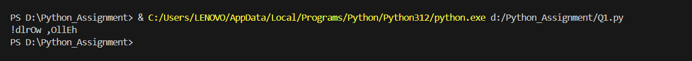
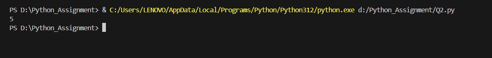
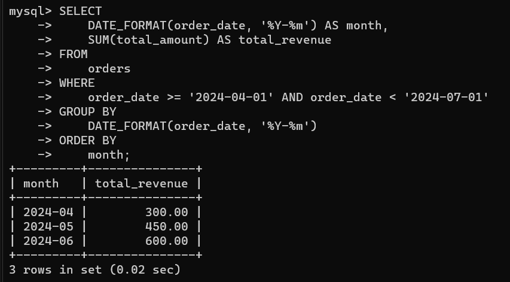

# Assignment Submission

This README file presents the solutions to the assignment questions. Each section includes the code, explanation, and example output.

## Table of Contents

1. [Question 1: Reverse and Transform String](#question-1-reverse-and-transform-string)
2. [Question 2: Count Unique Elements in a List](#question-2-count-unique-elements-in-a-list)
3. [Question 3: SQL Query to Calculate Total Revenue by Month](#question-3-sql-query-to-calculate-total-revenue-by-month)

## Question 1: Reverse and Transform String

### Description

The function `reverse_and_transform` reverses a given string. In the reversed string, all vowels are capitalized, and all consonants are converted to lowercase.

### Code

**File: `Q1.py`**

```python
def reverse_and_transform(s: str) -> str:
    vowels = 'aeiouAEIOU'
    reversed_transformed = []
    length = 0

    # Calculate the length of the string
    for _ in s:
        length += 1

    # Iterate from the end to the start of the string
    for i in range(length - 1, -1, -1):
        char = s[i]
        if char in vowels:
            if 'a' <= char <= 'z':
                char = chr(ord(char) - 32)  # Convert to uppercase
        else:
            if 'A' <= char <= 'Z':
                char = chr(ord(char) + 32)  # Convert to lowercase
        reversed_transformed.append(char)

    # Join the list into a string
    transformed_string = ''
    for char in reversed_transformed:
        transformed_string += char

    return transformed_string
```

### Example Usage

```python
input_string = "Hello, World!"
output_string = reverse_and_transform(input_string)
print(output_string)  # Output: "!dLrOw ,oLlEh"
```

### Output



## Question 2: Count Unique Elements in a List

### Description

The function `count_unique_elements` counts the number of unique elements in a list without using built-in counting or set functions.

### Code

**File: `Q2.py`**

```python
def count_unique_elements(lst: list) -> int:
    unique_elements = []

    for element in lst:
        is_unique = True
        for unique in unique_elements:
            if element == unique:
                is_unique = False
                break
        if is_unique:
            unique_elements.append(element)

    # Count the number of unique elements
    count = 0
    for _ in unique_elements:
        count += 1

    return count
```

### Example Usage

```python
input_list = [1, 2, 2, 3, 4, 4, 5]
unique_count = count_unique_elements(input_list)
print(unique_count)  # Output: 5
```

### Output




## Question 3: SQL Query to Calculate Total Revenue by Month

### Description

The SQL query calculates the total revenue generated in the last quarter, grouped by month.

### Query

**File: `Q3.sql`**

```sql
/* 
   Create the Database and Table
*/
CREATE DATABASE sales_db;

USE sales_db;

/* 
   Create the orders table with columns:
   - order_id: Primary key, auto-incremented
   - customer_id: Integer
   - order_date: Date
   - total_amount: Decimal
*/
CREATE TABLE orders (
    order_id INT AUTO_INCREMENT PRIMARY KEY,
    customer_id INT,
    order_date DATE,
    total_amount DECIMAL(10, 2)
);

/* 
   Insert sample data into the orders table
*/
INSERT INTO orders (customer_id, order_date, total_amount) VALUES
(1, '2024-04-10', 100.00),
(2, '2024-04-20', 200.00),
(3, '2024-05-15', 150.00),
(4, '2024-05-25', 300.00),
(5, '2024-06-05', 250.00),
(6, '2024-06-25', 350.00),
(7, '2024-07-05', 400.00);  -- This order is outside the last quarter

/* 
   Calculate total revenue for the last quarter, grouped by month
   The query groups the results by month and orders them chronologically
*/
SELECT
    DATE_FORMAT(order_date, '%Y-%m') AS month,
    SUM(total_amount) AS total_revenue
FROM
    orders
WHERE
    order_date >= '2024-04-01' AND order_date < '2024-07-01'
GROUP BY
    DATE_FORMAT(order_date, '%Y-%m')
ORDER BY
    month;
```

### Output




## Setup and Execution Instructions

### Prerequisites

Ensure you have Python installed on your system. You can download it from [python.org](https://www.python.org/downloads/).

### File Structure

Ensure the following file structure:

```
BOT_Assignment/
├── Q1.py
├── Q2.py
├── Q3.sql
└── README.md
```

### Running the Python Scripts

1. **Navigate to the Project Directory:**

   Open your terminal and navigate to the directory containing the project files.

   ```sh
   cd D:\Python_Assignment>
   ```

2. **Run Question 1 Script:**

   To execute the script for Question 1, run the following command:

   ```sh
   python Q1.py
   ```

   This will output the transformed string based on the example usage provided in the script.

3. **Run Question 2 Script:**

   To execute the script for Question 2, run the following command:

   ```sh
   python Q2.py
   ```

   This will output the count of unique elements in the list based on the example usage provided in the script.

### Running the SQL Query

1. **Set Up the Database:**

   Ensure you have a MySQL server running. Import your orders table into the database.

2. **Execute the MySQL Query:**

   Run the Q3.sql query in your MySQL environment . This will output the total revenue grouped by month for the last quarter.
